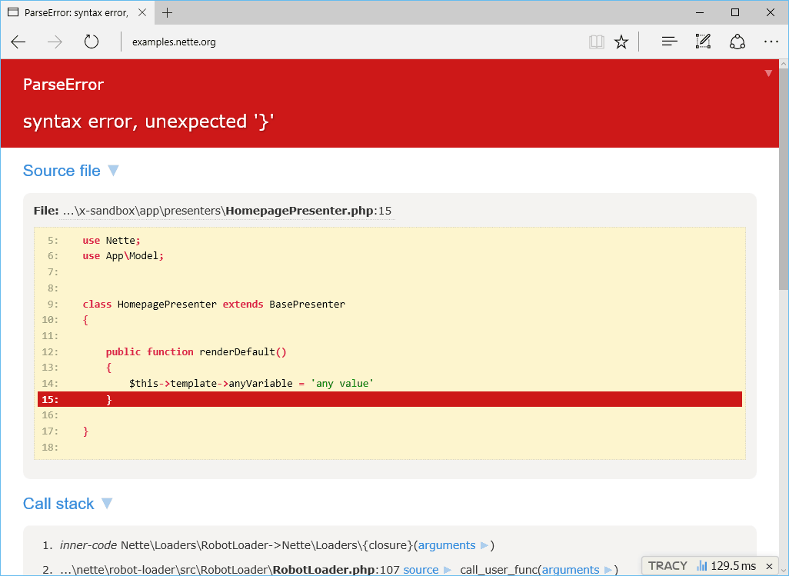

# Tracy plugin for Craft CMS 3.x

**[Tracy](https://tracy.nette.org/)** is a must-have debugging tool for all PHP developers.

Plugin combines [nette/tracy](https://github.com/nette/tracy) and [idmarinas/tracy-twig-bar](https://github.com/idmarinas/tracy-twig-bar).



## Requirements

This plugin requires Craft CMS 3.x or later.

## Installation

To install the plugin, follow these instructions.

1. Open your terminal and go to your Craft project:

        cd /path/to/project

2. Then tell Composer to load the plugin:

        composer require licvido/craft-tracy

3. In the Control Panel, go to Settings → Plugins and click the “Install” button for Tracy.

## Usage

The plugin makes following functions available in templates:

```twig
{{ dump(entity) }} - Dump variable in place.

{{ dumpe(entity) }} - Dump variable in place and exit.

{{ bdump(entity) }} - Dump variable to debug bar.
```
